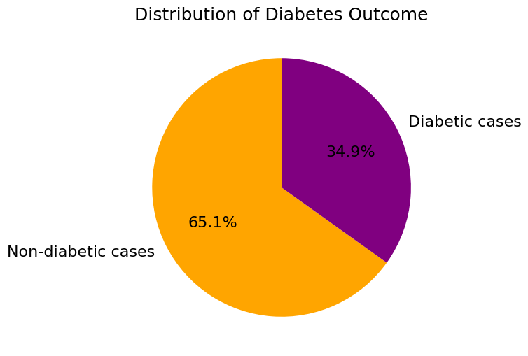
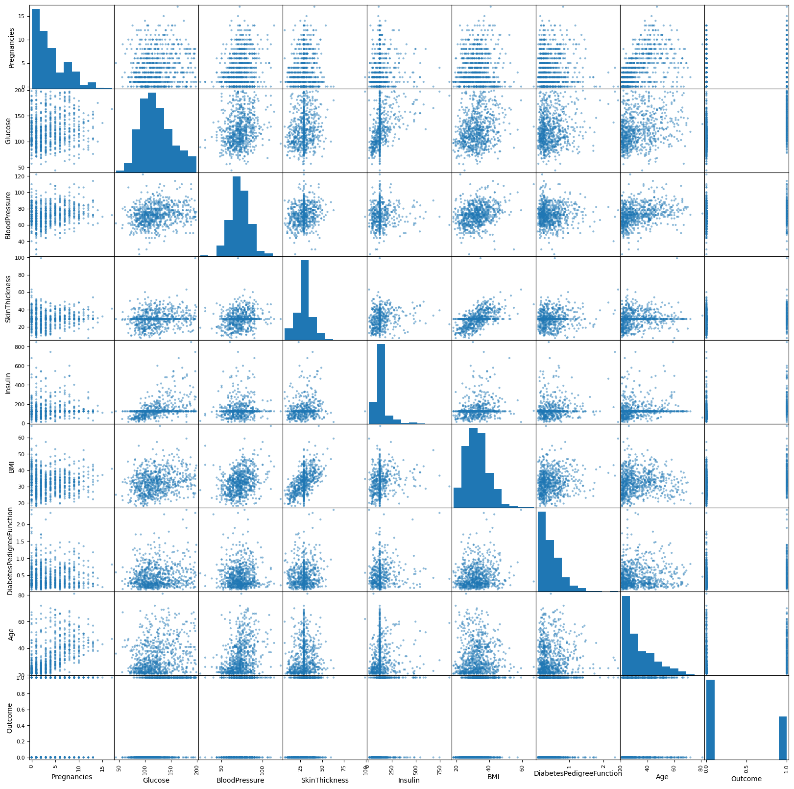
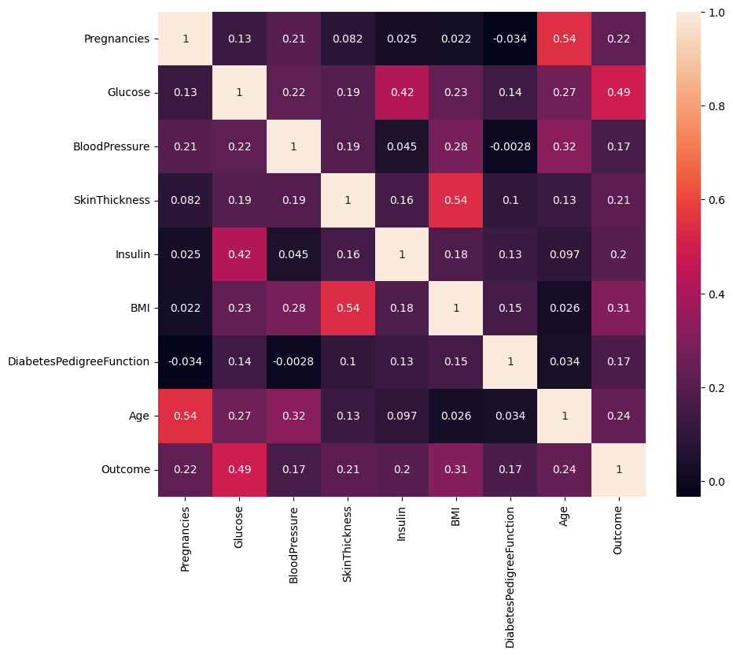
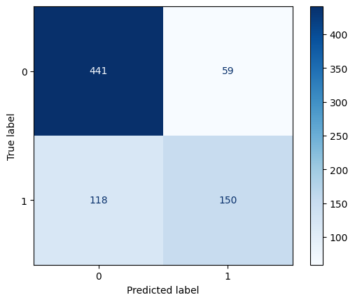
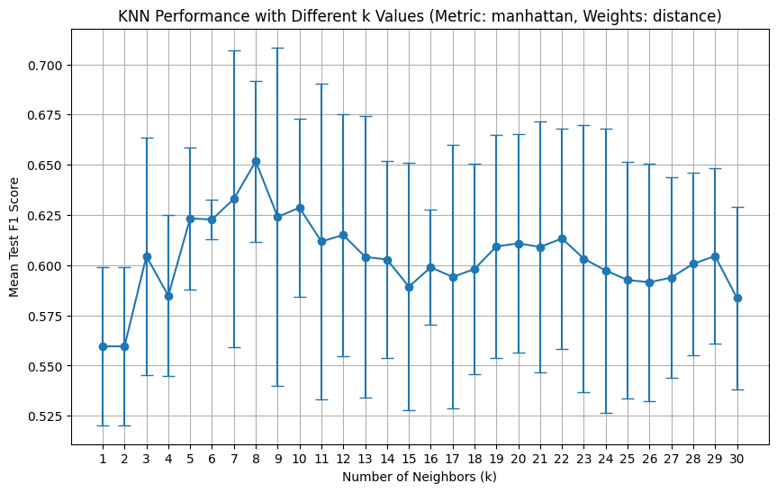
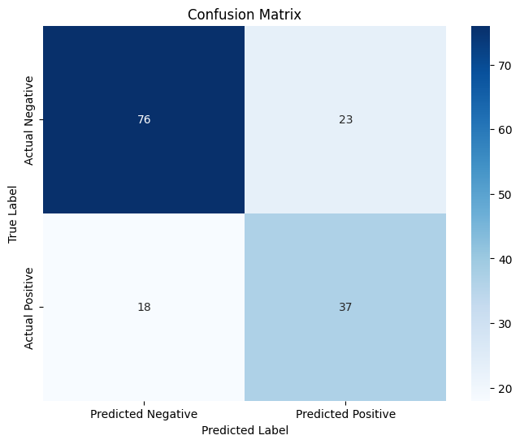
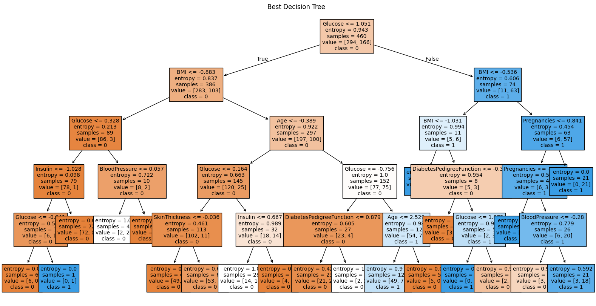
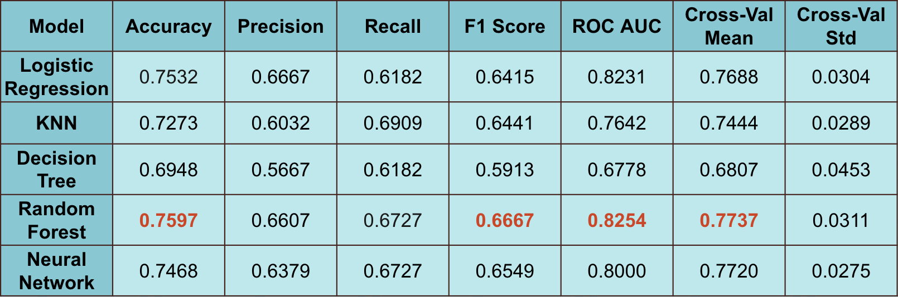
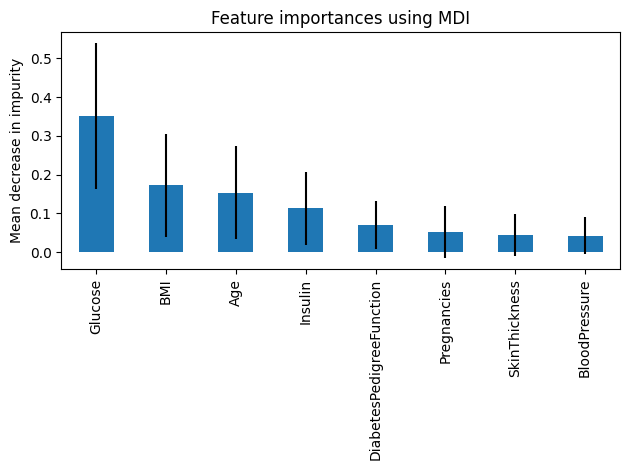

# What Factors Might Influence the Risk of Getting Diabetes?
## Minjoo Kim, Zoey Zeng, Jennifer Liu, Laura Wang

## Table of Contents
1. [Abstract](#abstract)
2. [Introduction](#introduction)
3. [Dataset and Setup](#dataset-and-setup)
4. [Results](#results)
    - [1. Cross-Validation](#1-cross-validation)
    - [2. KNN](#2-knn)
    - [3. Decision Tree](#3-decision-tree)
    - [4. Model Selection](#4-model-selection)
    - [5. Random Forest](#5-random-forest)
    - [6. Feature Importance](#6-feature-importance)
5. [Discussion](#discussion)
6. [Conclusion](#conclusion)
7. [References](#references)

## Abstract
Diabetes remains a critical public health issue, particularly in Georgia, where it affects nearly 1 million individuals and places a significant burden on healthcare systems. This study leverages machine learning models, including Logistic Regression, K-Nearest Neighbors, Decision Trees, Random Forest, and Neural Networks, to analyze key predictors of diabetes using the Pima Indians Diabetes Database. By examining physiological, demographic, and genetic factors such as glucose levels, BMI, and age, we identify critical contributors to diabetes risk and assess the performance of various predictive models. Our findings provide insights into diabetes progression and offer actionable knowledge to inform prevention and intervention strategies.

## Introduction
In 2021, there were about 38.4 million people of all ages who had diabetes in 2021 in the U.S. 8.7 million adults ages 18 years or older who met laboratory criteria for diabetes were not aware of or did not report having diabetes. Among this group, there were 352,000 children and adolescents younger than age 20 who had been diagnosed with diabetes. Moreover, the percentage of adults with diabetes increased with age, reaching 29.2% among those aged 65 years or older. As we can see, diabetes is a chronic health condition that affects millions worldwide, posing significant challenges to public health and individual well-being. A lot of hospitalizations and ER visits due to diabetes are placing a significant burden on healthcare resources. Diabetes impacts not only individuals' health but also families and communities, with strong genetic ties and lifestyle factors contributing to its prevalence. The increasing prevalence of diabetes highlights the need for accurate identification of key risk factors and improved prediction methods to facilitate early intervention and effective management. Our primary goal of this project is to analyze the factors that contribute to the onset of diabetes using machine learning techniques. By leveraging the Pima Indians Diabetes Database, we aim to identify critical predictors of diabetes and assess the performance of various machine learning models in predicting diabetes outcomes.

To achieve this goal, we implemented a systematic approach involving data preprocessing, exploratory data analysis, feature selection, and the evaluation of several machine learning algorithms. We are going to first clean the dataset to handle missing or implausible values such as zero entries in features like Glucose and BMI, which were replaced with mean values. The dataset was split into training and testing sets (80:20) to ensure fair evaluation. After this, pair plots and heatmaps were generated to identify relationships between features and the outcome variable. Outliers and skewed distributions in features like Insulin and Pregnancies were identified, guiding data preprocessing and model refinement. We then evaluated five machine learning models: Logistic Regression, K-Nearest Neighbors (KNN), Decision Tree, Random Forest, and Neural Network. Hyperparameter tuning was performed using GridSearchCV to optimize each model's performance. Cross-validation techniques, including 5-Fold Cross-Validation and Leave-One-Out Cross-Validation (LOOCV), were employed to ensure the robustness and generalizability of results. At last, performance was assessed using metrics such as Accuracy, Precision, Recall, F1 Score, ROC AUC, and Cross-Validation Mean and Standard Deviation. The Random Forest model was further analyzed for feature importance, providing insights into the most influential predictors of diabetes. By combining these approaches and techniques, our research study contributes to improving diabetes prediction models and understanding the role of key risk factors, which can guide future prevention and intervention strategies.

## Dataset and Setup
The dataset used for this experiment is the Pima Indians Diabetes Database sourced from Kaggle, comprising 768 rows and 9 columns. The dataset includes variables such as the number of pregnancies, plasma glucose concentration, diastolic blood pressure, triceps skin fold thickness, 2-hour serum insulin, body mass index (BMI), diabetes pedigree function (a measure of genetic influence), age, and the outcome variable indicating diabetes diagnosis (0 = No, 1 = Yes). The dataset is imbalanced, with 500 non-diabetic cases (65%) and 268 diabetic cases (35%).

From the pairplot, we observe that Glucose and BMI have a strong visual relationship with Outcome, and features like Insulin and SkinThickness contain outliers. The diagonal histograms also show that Pregnancies and Insulin are highly skewed, indicating potential preprocessing needs. The heatmap further quantifies these relationships. Glucose has the strongest correlation with Outcome (0.49), making it a key predictor. Variables like BMI and Age followed with a strong correlation to Outcome. While some features have notable correlations, others, like DiabetesPedigreeFunction and BloodPressure, show weak associations with Outcome. This analysis guides feature importance evaluation and model refinement.

 

The experimental setup involves splitting the data into training and testing sets using an 80-20 ratio. Data cleaning was performed by replacing zero values with the mean of each respective feature to handle missing or implausible entries. The models evaluated include Logistic Regression, K-Nearest Neighbors (KNN), Decision Tree, Random Forest, and a Neural Network, with performance assessed using K-fold cross-validation to ensure robustness. The experiments were executed in a standard computing environment with all necessary libraries and frameworks pre-installed.

## Results
### 1. Cross-Validation
The cross-validation techniques employed, including Leave-One-Out Cross-Validation (LOOCV) and 5-fold Cross-Validation, provide a comprehensive evaluation of the logistic regression model's performance on the diabetes dataset.

LOOCV yielded a precision of 71.77% and a recall of 55.97%. These results, alongside the confusion matrix, suggest a moderate ability of the model to correctly identify positive cases (precision) but a somewhat limited capacity to capture all actual positive instances (recall). The relatively high number of false negatives (118) compared to false positives (59) indicates a tendency for the model to under-predict the positive class. This is a common observation in imbalanced datasets like this one, where the negative class (non-diabetic) significantly outnumbers the positive class (diabetic).

5-Fold Cross-Validation, on the other hand, presented an average accuracy of 76.96% with a standard deviation of 2.79%. This indicates a generally consistent performance across different subsets of the data, with the accuracy varying within a relatively narrow range. The low standard deviation suggests that the model's performance is stable and not highly sensitive to the specific composition of the training and validation sets in each fold.

### 2. KNN
The K-Nearest Neighbors (KNN) algorithm was implemented to predict diabetes outcomes, with careful consideration given to feature standardization and hyperparameter optimization. The model's performance was rigorously assessed using 5-fold cross-validation, coupled with GridSearchCV to fine-tune the hyperparameters for optimal results, particularly focusing on the F1 score as the primary evaluation metric.

### 3. Decision Tree
The Decision Tree model, a fundamental machine learning algorithm known for its interpretability, was trained and evaluated on the diabetes dataset. To optimize its performance, hyperparameter tuning was conducted using GridSearchCV in conjunction with 5-fold cross-validation, focusing on the F1-score as the key metric for selecting the best model.

### 4. Model Selection

We evaluated five machine learning models—Logistic Regression, K-Nearest Neighbors (KNN), Decision Tree, Random Forest, and Neural Network—using various performance metrics, including Accuracy, Precision, Recall, F1 Score, ROC AUC, and Cross-Validation (CV) Mean and Standard Deviation.

Based on the results, Random Forest was identified as the best-performing model. It achieved the highest Accuracy (0.7597), F1 Score (0.6667), ROC AUC (0.8254), and Cross-Validation Mean (0.7737), demonstrating robustness across multiple metrics. While Logistic Regression attained high Accuracy (0.7532) and the highest Precision (0.6667), this result may be influenced by the imbalance in the outcome variable, which can skew accuracy as a reliable measure.

Given its consistent performance across Accuracy, F1 Score, ROC AUC, and Cross-Validation metrics, we selected Random Forest as the optimal model for the remainder of our analysis. This model's ability to balance precision and recall makes it particularly suitable for identifying individuals at risk of diabetes.

### 5. Random Forest

To further optimize performance, we conducted a grid search on two critical hyperparameters—n_estimators (number of trees) and max_depth (maximum depth of each tree)—using the validation set to identify the best combination for the Random Forest model. The grid search systematically explored multiple values for these parameters, evaluating the model's performance on the validation set to avoid overfitting. The best-performing combination of parameters was selected, after which the model was trained on the full training set and evaluated on the test set. The optimized Random Forest achieved a training F1 score of 0.7116 and a test F1 score of 0.6733, indicating a good balance between learning the training data and generalizing to unseen data.

### 6. Feature Importance

We utilized the results from our Random Forest model to analyze feature importance, as shown in the graph above. The Mean Decrease in Impurity (MDI) highlights the key predictors for diabetes. The top three most influential features are Glucose, BMI, and Age, which align with existing medical knowledge and intuition.

Glucose is the most significant feature, reflecting its central role in diagnosing diabetes. BMI, a measure of body fat, and Age, a well-known risk factor, further emphasize the importance of physiological and demographic variables in diabetes prediction. Other features, such as Diabetes Pedigree Function and Blood Pressure, contribute to the model but to a lesser extent. These findings reinforce the robustness of our Random Forest model in identifying clinically relevant predictors of diabetes.

## Discussion

## Conclusion

## References
